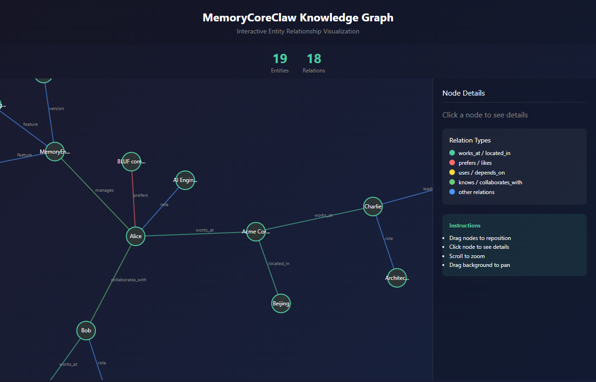
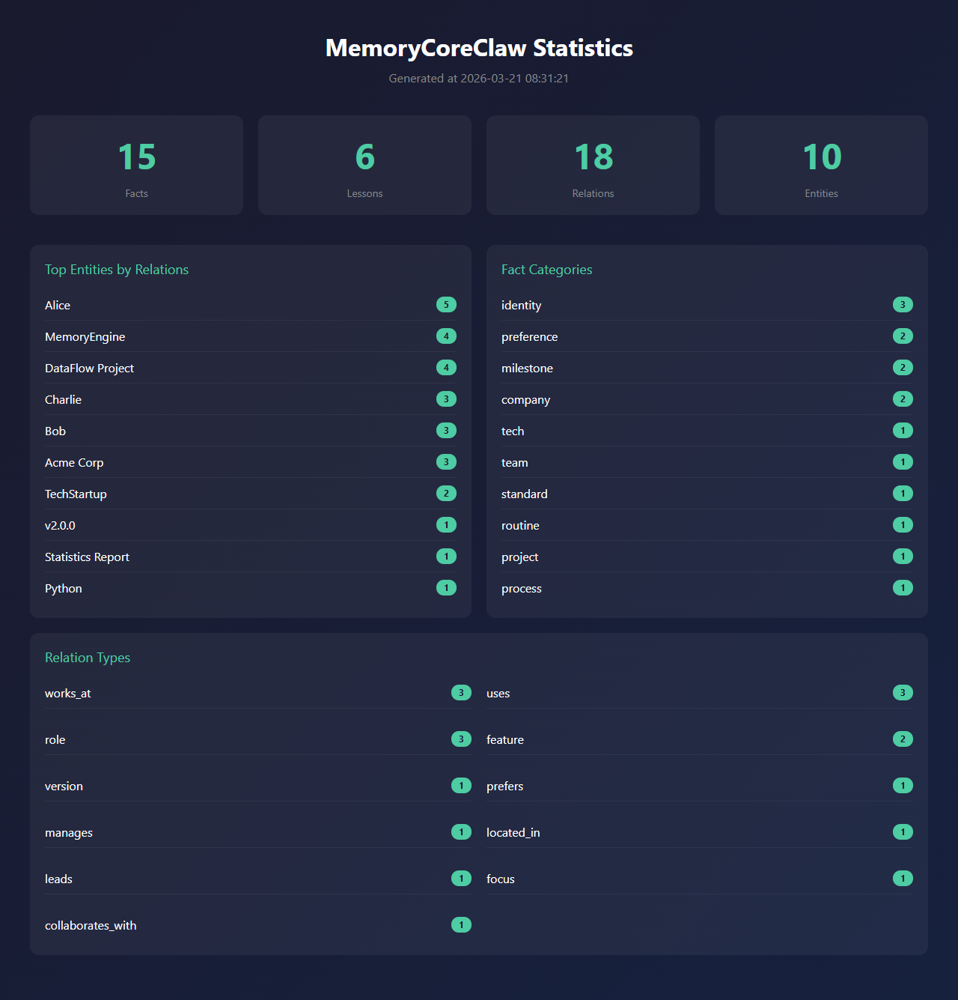
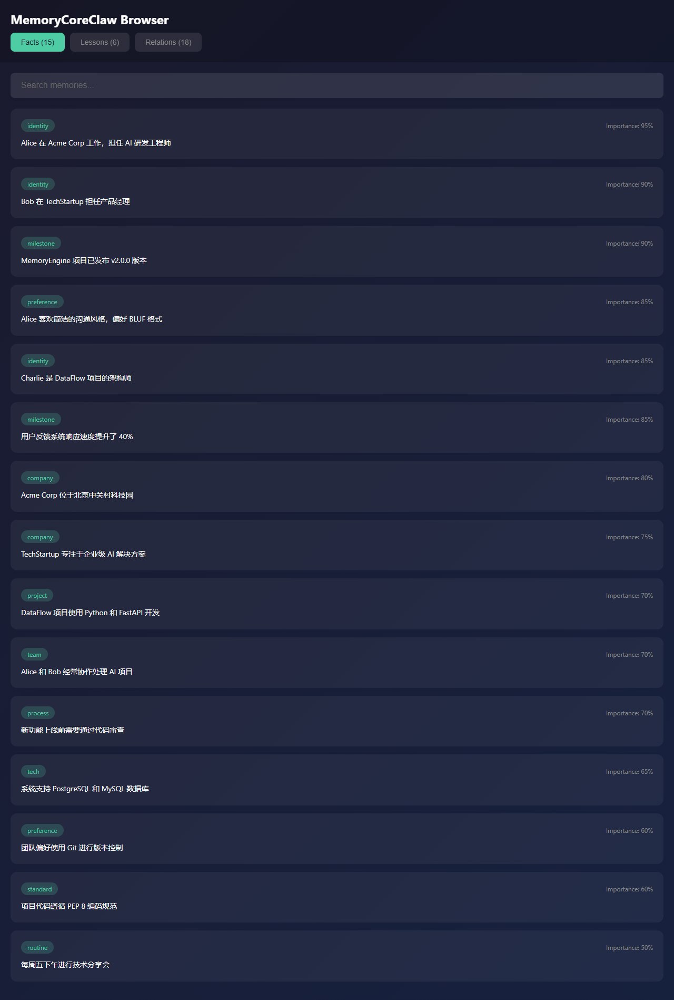

# MemoryCoreClaw

> 类人脑长期记忆引擎，为 AI Agent 提供持久化记忆能力

[](https://www.python.org/downloads/)
[](https://opensource.org/licenses/MIT)
[](https://github.com/lcq225/MemoryCoreClaw/releases)

---

## 📖 简介

MemoryCoreClaw 是一个模拟人类大脑记忆机制的长期记忆引擎，专为 AI Agent 设计。它实现了分层记忆、遗忘曲线、情境触发、工作记忆等认知科学概念，让 AI Agent 拥有"记忆"能力。

### 为什么需要 MemoryCoreClaw？

传统 AI Agent 的对话上下文有限，无法长期记住用户偏好、历史交互等信息。MemoryCoreClaw 解决了这个问题：

| 传统方式 | MemoryCoreClaw |
|---------|----------------|
| 上下文窗口有限 | 永久记忆存储 |
| 无法记住用户偏好 | 记住并关联用户信息 |
| 每次对话从零开始 | 自动召回相关记忆 |
| 无知识积累 | 知识图谱持续增长 |

---

## ✨ 特性

### 🧠 分层记忆
- **核心层** (importance ≥ 0.9)：永久保留，注入上下文
- **重要层** (0.7 ≤ importance < 0.9)：长期保留
- **普通层** (0.5 ≤ importance < 0.7)：定期整合
- **次要层** (importance < 0.5)：可能衰减

### 📉 遗忘曲线
基于 Ebbinghaus 遗忘曲线模型：
- 记忆强度随时间衰减
- 访问可增强记忆
- 低强度记忆可被清理

### 🎯 情境记忆
- 按人物、地点、情绪、活动绑定记忆
- 情境触发相关记忆召回
- 支持"上次我们在咖啡馆聊了什么"

### 💼 工作记忆
- 容量限制（7±2 模型）
- 优先级驱逐策略
- TTL 过期机制

### 🔗 关系学习
- 28 种标准关系类型
- 自动关系推断
- 知识图谱可视化

### 📤 导出功能
- JSON 格式导出
- Markdown 格式导出
- 知识图谱 HTML 可视化

### 📊 可视化（v2.0.0 新增）

- **知识图谱** - D3.js 交互式力导向图，支持拖拽、缩放、点击查看详情
- **统计报告** - 记忆数量、分类、关系类型可视化统计
- **记忆浏览器** - 可搜索的事实/教训/关系列表

#### 效果展示

**知识图谱：**



**统计报告：**



**记忆浏览器：**



```bash
# 生成可视化
python -m memorycoreclaw.utils.visualization

# 或使用环境变量指定路径
MEMORY_DB_PATH=/path/to/memory.db MEMORY_OUTPUT_DIR=./output python -m memorycoreclaw.utils.visualization
```

---

## 🚀 快速开始

### 安装

```bash
pip install memorycoreclaw
```

### 基础用法

```python
from memorycoreclaw import Memory

# 初始化
mem = Memory()

# 记住事实
mem.remember("Alice 在 TechCorp 工作", importance=0.8)
mem.remember("Alice 擅长 Python", importance=0.7, category="技术")

# 召回记忆
results = mem.recall("Alice")
for r in results:
    print(f"- {r['content']} (重要性: {r['importance']})")

# 学习经验
mem.learn(
    action="部署前未测试",
    context="生产环境发布",
    outcome="negative",
    insight="部署前必须测试",
    importance=0.9
)

# 建立关系
mem.relate("Alice", "works_at", "TechCorp")
mem.relate("Alice", "knows", "Bob")

# 查询关系
relations = mem.get_relations("Alice")
for rel in relations:
    print(f"{rel['from_entity']} --[{rel['relation_type']}]--> {rel['to_entity']}")

# 工作记忆
mem.hold("当前任务", "编写文档", priority=0.9)
task = mem.retrieve("当前任务")
print(f"当前任务: {task}")
```

---

## 📁 项目结构

```
MemoryCoreClaw/
├── memorycoreclaw/          # 核心代码
│   ├── core/                # 核心引擎
│   │   ├── engine.py        # 记忆引擎
│   │   └── memory.py        # 统一接口
│   ├── cognitive/           # 认知模块
│   │   ├── forgetting.py    # 遗忘曲线
│   │   ├── contextual.py    # 情境记忆
│   │   └── working_memory.py # 工作记忆
│   ├── retrieval/           # 检索模块
│   │   ├── semantic.py      # 语义搜索
│   │   └── ontology.py      # 本体论
│   ├── storage/             # 存储模块
│   │   ├── database.py      # 数据库
│   │   └── multimodal.py    # 多模态
│   └── utils/               # 工具模块
│       ├── export.py        # 导出
│       └── visualization.py # 可视化
├── docs/                    # 文档
│   ├── GETTING_STARTED.md   # 入门指南
│   ├── API.md               # API 参考
│   ├── ARCHITECTURE.md      # 架构文档
│   └── DEPLOYMENT.md        # 部署文档
├── examples/                # 示例代码
├── tests/                   # 测试用例
└── config/                  # 配置文件
```

---

## 📚 文档

- [入门指南](docs/GETTING_STARTED.md) - 快速上手
- [API 参考](docs/API.md) - 完整 API 文档
- [架构设计](docs/ARCHITECTURE.md) - 系统架构
- [部署文档](docs/DEPLOYMENT.md) - 安装部署

---

## 🔧 配置

默认配置文件 `config/default.yaml`：

```yaml
# 数据库配置
database:
  path: "~/.memorycoreclaw/memory.db"
  encrypt: false

# 记忆分层
layers:
  core:
    min_importance: 0.9
    retention: permanent
  important:
    min_importance: 0.7
    retention: long_term
  normal:
    min_importance: 0.5
    retention: standard
  minor:
    min_importance: 0.0
    retention: may_decay

# 遗忘曲线
forgetting:
  enabled: true
  min_strength: 0.1
  access_bonus: 1.1

# 工作记忆
working_memory:
  capacity: 9
  eviction_policy: lowest_priority
```

---

## 🤝 集成示例

### 与 LangChain 集成

```python
from langchain.memory import BaseMemory
from memorycoreclaw import Memory

class MemoryCoreClawMemory(BaseMemory):
    """LangChain 记忆适配器"""
    
    def __init__(self, db_path=None):
        self.mem = Memory(db_path=db_path)
    
    @property
    def memory_variables(self):
        return ["memory_context"]
    
    def load_memory_variables(self, inputs):
        query = inputs.get("input", "")
        memories = self.mem.recall(query, limit=5)
        context = "\n".join([m["content"] for m in memories])
        return {"memory_context": context}
    
    def save_context(self, inputs, outputs):
        user_input = inputs.get("input", "")
        ai_output = outputs.get("output", "")
        self.mem.remember(f"User: {user_input}", importance=0.5)
        self.mem.remember(f"AI: {ai_output}", importance=0.5)
    
    def clear(self):
        pass

# 使用
from langchain.chat_models import ChatOpenAI
from langchain.chains import ConversationChain

memory = MemoryCoreClawMemory()
llm = ChatOpenAI()
chain = ConversationChain(llm=llm, memory=memory)
```

### 作为 RAG 增强

```python
from memorycoreclaw import Memory

mem = Memory()

# 在 RAG 查询前注入相关记忆
def enhanced_rag_query(query):
    # 召回相关记忆
    memories = mem.recall(query, limit=3)
    context = "\n".join([m["content"] for m in memories])
    
    # 增强查询
    enriched_query = f"""
上下文记忆：
{context}

用户问题：{query}
"""
    return enriched_query

# 查询后记住新信息
mem.remember(f"用户询问了：{query}", importance=0.6)
```

---

## 📊 性能指标

| 指标 | 数值 |
|------|------|
| 记忆存储 | SQLite，支持百万级记录 |
| 查询延迟 | < 10ms（关键词搜索） |
| 内存占用 | < 50MB（10万条记忆） |
| 并发支持 | 多进程读取安全 |

---

## 🛠️ 开发

### 环境搭建

```bash
# 克隆仓库
git clone https://github.com/lcq225/MemoryCoreClaw.git
cd MemoryCoreClaw

# 创建虚拟环境
python -m venv venv
source venv/bin/activate  # Linux/Mac
# 或
.\venv\Scripts\activate  # Windows

# 安装开发依赖
pip install -e ".[dev]"

# 运行测试
python tests/standalone_test.py
```

### 运行示例

```bash
# 基础示例
python examples/basic_usage.py

# 知识图谱示例
python examples/knowledge_graph.py
```

---

## 🤝 贡献

欢迎贡献！请查看 [贡献指南](CONTRIBUTING.md)。

---

## 📄 许可证

[MIT License](LICENSE)

---

## 📮 联系方式

- GitHub: [https://github.com/lcq225/MemoryCoreClaw](https://github.com/lcq225/MemoryCoreClaw)
- Issues: [https://github.com/lcq225/MemoryCoreClaw/issues](https://github.com/lcq225/MemoryCoreClaw/issues)

---

**MemoryCoreClaw** - 让 AI Agent 拥有记忆 🧠